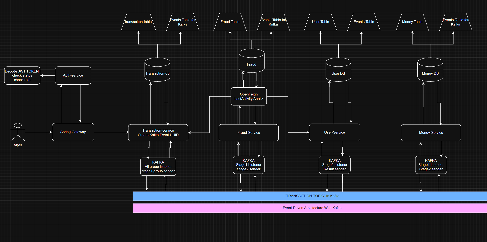

# SpringBank-with-Microservices

## Projenin Mimari Çizimi (Transfer Mimari Cizimi guncel degildir en kisa surede guncellenecektir.)

     Create User
  
     Transfer
  

<h4> Draw Io'da Aç </h4>

  <h2> Projedeki Teknolojiler </h2>
    <h4>1 - Java 21</h4>
    <h4>2 - Spring Boot</h4>
    <h4>3 - Kubernetes</h4>
    <h4>4 - Spring Security</h4>
    <h4>5 - Kafka ile Event Driven Architecture</h4>
    <h4>6 - Container Docker image destekli</h4>
    <h4>7 - Exception Handling</h4>
    <h4>8 - Redis</h4>
    <h4>9 - Global Exception Handling</h4>
    <h4>10 - Keycloak JWT</h4>
    <h4>11 - Spring Gateway</h4>
    <h4>12 - Dogru Mikroservis Anlayisi ve mikroservis icerikli kod.</h4>
    <h4>13 - Hpa(Kubernetes'ın ıcınde)</h4>
    <h4>14 - Gson ( Google Json )</h4>
    <h4>15 - Jpa</h4>
    <h4>16 - PostgreSql</h4>
    <h4>17 - Endpoint Kullanimi</h4>
    <h4>18 - Spring WebFlux</h4>
    <h4>19 - Spring Gateway</h4>
    <h4>20 - Spring Cloud LoadBalancer</h4>
    <h4>21 - Lombok</h4>    
  

## Yeni Event-Driven Transfer (EFT) Mimarisi ve Akışı

Projedeki transfer (EFT), yatırma (Deposit) ve çekme (Withdraw) işlemleri tamamen asenkron, mikroservislerin birbirini beklemediği **Event-Driven Architecture (Olay Güdümlü Mimari)** prensipleriyle çalışmaktadır. İşlemler sırasında oluşabilecek hatalar (örn. yetersiz bakiye, ağ hatası, dolandırıcılık tespiti) anlık olarak yakalanır ve veritabanına işlenerek kullanıcıya gösterilir.

Bu yapıda **Transaction Service**, **Money Service** ve **Fraud Service** birbirleriyle Kafka üzerinden mesajlaşır. Eski hantal ve bağımlı yapı kaldırılarak yerine **Saga Choreography Pattern** benzeri bir akış inşa edilmiştir.

### 💳 1. EFT Transfer (Para Transferi) Akışı

Bir kullanıcı para göndermek istediğinde gerçekleşen olay silsilesi şöyledir:

1. **İşlem Başlatılır (Transaction Service):**
   * Kullanıcıdan gelen transfer isteği API tarafında karşılanır.
   * `TransactionService`'de işlem veritabanına ilk olarak **`CREATED` ("İşleminiz alındı")** statüsüyle kaydedilir.
   * Mesaja özel benzersiz bir `eventUUID` atanır. Bu UUID, tüm servisler arasında transferin kimliği olur.
   * İstek, `transaction-service.eft.v1` topic'ine fırlatılır.

2. **Paranın Bloke Edilmesi (Money Service):**
   * Money Service, `transaction-service.eft.v1` topic'ini dinler.
   * Gelen isteği alır ve göndericinin hesabından parayı düşüp, bu tutarı "Bloke Bakiye" (`blockedMoney`) olarak kaydeder.
   * Bloke başarılıysa statü **`BLOCK_MONEY` ("Tutar rezerve edildi")** olarak güncellenir.
   * İşlem güvenlik kontrolü için fraud-service'in dinlediği `block-money.success.v1` topic'ine yollanır.
   * *(Eğer bakiye yetersizse veya hesap yoksa işlem iptal edilir ve hata topic'ine yollanır.)*

3. **Güvenlik ve Dolandırıcılık Kontrolü (Fraud Service):**
   * Fraud Service, `block-money.success.v1` topic'inden mesajı alır.
   * Statüyü hemen **`FRAUD_REVIEW` ("İşleminiz inceleniyor")** yapar.
   * Veritabanından (veya Redis'ten) göndericinin işlem geçmişine bakar; aynı IP'den sık işlem, aşırı miktar gibi kuralları (ruloları) denetler.
   * Eğer her şey temizse, statüyü güncelleyerek onayı `fraud-service.success.v1` topic'ine iletir.
   * *(Kontrol geçilemezse işlem reddedilir, statü `FRAUD_REJECTED` olur, bloke çözülmesi için hata topic'ine bilgi verilir.)*

4. **Transferin Tamamlanması (Money Service):**
   * Money Service, fraud'dan gelen onayı `fraud-service.success.v1` topic'inden okur.
   * İlk başta bloke edilen tutarı alıcının hesabına aktarır (Gönderici blokesi çözülür, alıcının net bakiyesi artar).
   * Statü **`COMPLETED` ("İşlem tamamlandı")** olur.
   * Son onay, tüm süreci yöneten transaction-service'in göreceği başarı topic'ine (`transaction-service.success.v1`) yollanır.

### 🔁 Wildcard Listener ile Anlık Status Takibi
Transaction Service, sadece transfer başlatmakla kalmaz; asıl görevi işlemlerin hangi aşamada olduğunu bilmektir. Bunun için her bir servisin geri bildirim yaptığı ayrı topic'leri (logger topic vs.) tek tek dinlemek yerine **Kafka Wildcard Topic Pattern** (`banking-microservices.transaction.*`) kullanır.
Money veya Fraud servisinde statü ne zaman değişse, bu bilgi DTO (Data Transfer Object) içindeki `status` alanına yazılarak Kafka'ya basılır. Transaction Service bu mesajı kapıp hemen Postgres'teki işlem statüsünü (örn. `FRAUD_REVIEW` -> `BLOCK_MONEY`) günceller. Kullanıcı ekranında paranın hangi aşamada takıldığını anlık olarak görebilir.

### 🛡️ 2-Adımlı Idempotency (Mesaj Tekrarını Önleme)

Kafka'da bazen aynı mesaj iki kere gelebilir (Network kopması, offset commit edilememesi vs). Para transferinde aynı mesajın iki kere işlenmesi (örn. 100 TL gönderirken 200 TL gitmesi) faciadır. Bunu engellemek için tüm listener'larda **Idempotency** mekanizması bulunur.

Örneğin Fraud Service'de:
1. Mesaj geldiğinde hemen MongoDB'deki `KafkaEvent` tablosuna `EFT_CHECK_RECEIVED` adıyla bir kayıt atılır.
2. Eğer "Sisteme aynı saniye içinde aynı UUID ile kopyası" gelirse, kod tabana bakar: *"Aaa, bu UUID için RECEIVED kaydı var, demek ki bir thread şu an bunu işliyor"* der ve ikinci mesajı **sessizce çöpe atar (skip).**
3. İşlem başarıyla bitince aynı UUID için `EFT_CHECK_DONE` kaydı atılır.

Bu yapı `Money`, `Fraud` ve `Transaction` servislerinin tüm listener'larında (`KafkaEventType` enumları ile) mevcuttur.

### 🚫 Global Exception ve Kafka Hata Yönetimi
Eğer akışın herhangi bir noktasında (örneğin Money Service parayı bloke ederken `IbanNotFoundException` fırlatırsa):
1. Servis kendi içindeki `TransactionErrorHandler`'ı devreye sokar.
2. Hatayı yakalayıp DTO içindeki statüyü duruma göre `FAILED`, `VALIDATION_FAILED` veya `KAFKA_ERROR` olarak setler.
3. Mesajı `banking-microservices.transaction.error.v1` topic'ine fırlatır.
4. Transaction Service bu topic'i okur (Idempotency ile çift işlemden korur), işlemin veritabanındaki statüsünü "Başarısız" olarak çeker. Gerekirse rollback yapılması için diğer servislere telafi edici işlem (Compensating Transaction) mesajı gönderilir.

Tüm bu sistem, `KafkaStepType` gibi gereksiz detaylardan arındırılıp, tamamen `TransactionStatus` (örn: "İşlem güvenlik kontrolünden geçemedi") üzerinden, kullanıcıya gösterilecek kadar sade ama arka planda milyonlarca işlemi hatasız yönetecek kadar da stabil hale getirilmiştir.
