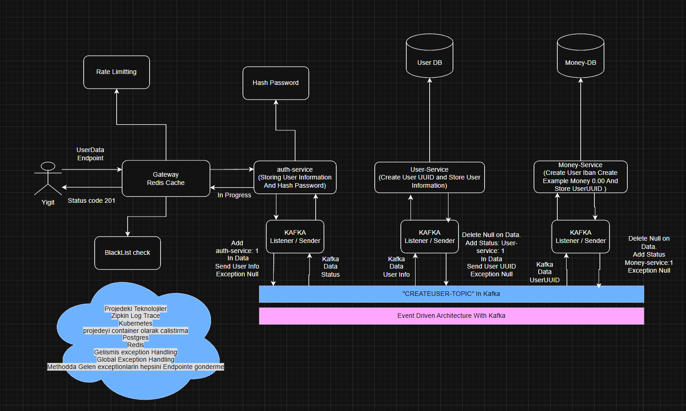

# SpringBank-with-Microservices

## Projenin Mimari Çizimi

  

<h4> Draw Io'da Aç </h4>

  <h2> Projedeki Teknolojiler </h2>
    <h4>1 - Zipkin Log Trace</h4>
    <h4>2 - Kubernetes</h4>
    <h4>3 - Spring Security</h4>
    <h4>4 - Kafka ile Event Driven Architecture</h4>
    <h4>5 - Container Docker image destekli</h4>
    <h4>6 - Gelismis Exception Handling</h4>
    <h4>7 - Redis</h4>
    <h4>7 - Rate Limitting</h4>
    <h4>7 - Global Exception Handling</h4>
    

