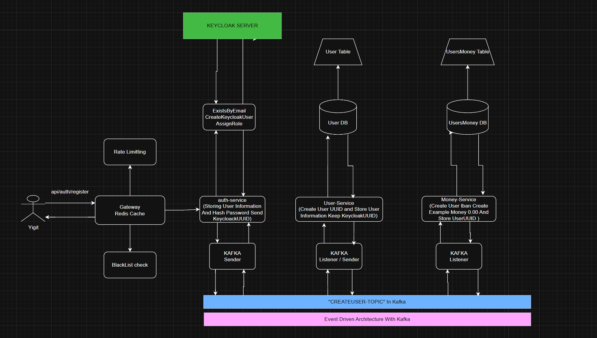
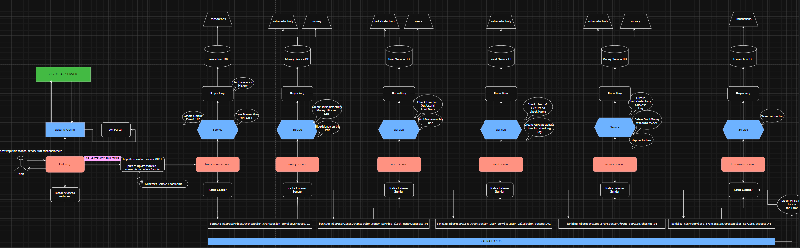

# SpringBank-with-Microservices

## Projenin Mimari Çizimi 
### Transfer Mimari cizim Guncellendi CreateUser mimarisi Eski ve yanlis. degistirilecek

     Create User
  
     Transfer
  

<h4> Draw Io'da Aç </h4>

  <h2> Projedeki Teknolojiler </h2>
    <h4>1 - Java 21</h4>
    <h4>2 - Spring Boot</h4>
    <h4>3 - Kubernetes</h4>
    <h4>4 - Spring Security</h4>
    <h4>5 - Kafka ile Event Driven Architecture</h4>
    <h4>6 - Container Docker image destekli</h4>
    <h4>7 - Exception Handling</h4>
    <h4>8 - Redis</h4>
    <h4>9 - Global Exception Handling</h4>
    <h4>10 - Keycloak JWT</h4>
    <h4>11 - Spring Gateway</h4>
    <h4>12 - Dogru Mikroservis Anlayisi ve mikroservis icerikli kod.</h4>
    <h4>13 - Hpa(Kubernetes'ın ıcınde)</h4>
    <h4>14 - Gson ( Google Json )</h4>
    <h4>15 - Jpa</h4>
    <h4>16 - PostgreSql</h4>
    <h4>17 - Endpoint Kullanimi</h4>
    <h4>18 - Spring WebFlux</h4>
    <h4>19 - Spring Gateway</h4>
    <h4>20 - Spring Cloud LoadBalancer</h4>
    <h4>21 - Lombok</h4>    
  

